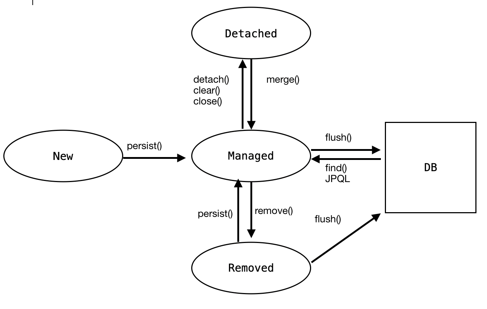

# Entity lifecycle
- entity lifecycle status
  1. 비영속 ( new / transient) : 영속성 컨텍스트와 전혀 관계가 없는 상태
  2. 영속 ( managed ) : 영속성 컨텍스트에 저장된 상태
  3. 준영속 ( detached ) : 영속성 컨텍스트에 저장 되었다가 분리된 상태
  4. 삭제 ( removed ) : 삭제된 상태

