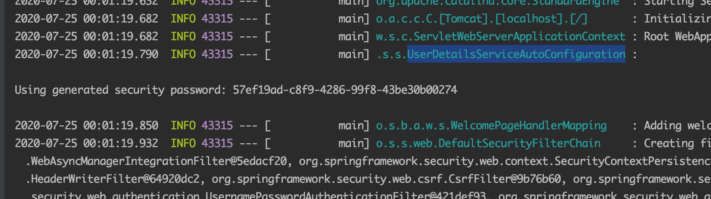
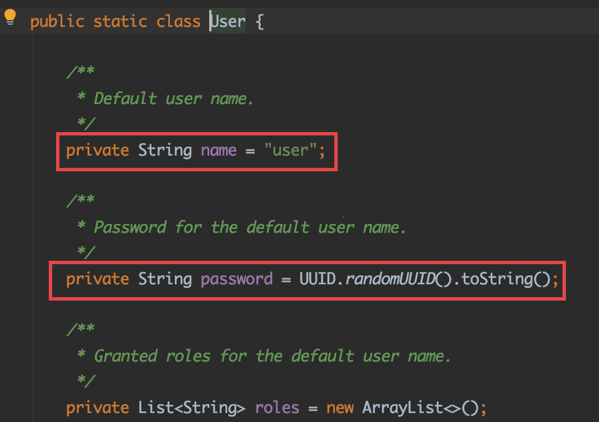

# Spring Security
- Spring Security 의존성만 추가해도 기본 인증 폼을 보내준다. ( 스프링 부트 사용시 설정이 자동 설정 되는 부분이 있음 ) ⇒ 자동 설정으로 id : user, password : 콘솔확인 으로 생성한다
- 시큐리티 설정

    ```java
    // 시큐리티 설정 파일임을 나타냄
    @Configuration
    @EnableWebSecurity
    public class SecurityConfig extends WebSecurityConfigurerAdapter {
        @Override
        protected void configure(HttpSecurity http) throws Exception {
            // 특정 요청에 대해 설정
            // 인가
            http.authorizeRequests()
                    .mvcMatchers("/", "/info").permitAll()  // 인증없이 접근 가능
                    .mvcMatchers("/admin").hasRole("ADMIN")  // role 에 따라 구분
                    .anyRequest().authenticated();   // 기타 요청은 인증을 하기만 하면 됨

            // 인증
            http.formLogin();  // form login 을 사용
            http.httpBasic();  // http basic authentication 사용
        }
    }
    ```



UserDetailsServiceAutoConfigration 에서 기본 유저 정보를 생성한다
- UserDetailsServiceAutoConfiguration 안에서 인메모리 방식으로 유저를 생성해주는 것을 알 수 있다

```java
@Bean
	@ConditionalOnMissingBean(
			type = "org.springframework.security.oauth2.client.registration.ClientRegistrationRepository")
	@Lazy
	public InMemoryUserDetailsManager inMemoryUserDetailsManager(SecurityProperties properties,
			ObjectProvider<PasswordEncoder> passwordEncoder) {
    
    // 시큐리티 프로퍼티의 유저 타입인 유저를 가져와 세팅하는 것을 확인
		SecurityProperties.User user = properties.getUser(); 
		List<String> roles = user.getRoles();
		return new InMemoryUserDetailsManager(
				User.withUsername(user.getName()).password(getOrDeducePassword(user, passwordEncoder.getIfAvailable()))
						.roles(StringUtils.toStringArray(roles)).build());
	}
```



- 따라서 설정 파일을 세팅하면 특정유저를 만들 수 있다 ⇒ 그냥 참고용으로만 ..

```java
// application.properties
spring.security.user.name=admin
spring.security.user.password=123
spring.security.user.roles=ADMIN
```

### 인메모리 유저 설정

```java
@Override
protected void configure(AuthenticationManagerBuilder auth) throws Exception {
    auth.inMemoryAuthentication()       // 인메모리 authentication 설정
        .withUser("sc").password("{noop}123").roles("USER").and()
        .withUser("admin").password("{noop}!@#").roles("ADMIN");
}
```

- AuthenticationManagerBuilder 에 이런 인증 방식을 사용하겠다고 알려주는 것(auth.inMemoryAuthentication())
- {noop} : Spring 5 부터는 시큐리티 암호는 무조건 암호화를 해야한다. 그리고 암호화 한 방법에 대해 알려줘야 하는 데, 그것을 괄호안에 정의한다. noop 은 암호화를 하지 않겠다는 의미

### JPA 연동
1. 의존성 추가
2. UserDetailsService : 스프링 시큐리티에서 DAO 인터페이스를 통해서 데이터 베이스에 있는 유저 정보를 가지고 인증을 하는 서비스 인터페이스
    - loadUserByUsername 메서드 : user 정보를 가져와서 UserDetails 를 리턴해줘야 함
    - User 의 빌더를 이용하여 간단하게 UserDetails 타입의 클래스를 생성해줄 수 있다
    - UserDetailsService 타입의 빈이 등록만 되어 있으면 config file 의 configure 메서드의 AuthenticationManagerBuilder 에 설정하지 않아도 된다.

### PasswordEncoder
- 패스워드 인코딩 방식을 결정해주는 빈
- NoOpPasswordEncoder 가 5.0 이전 기본 전략 - 현재 deprecated
    - 현재는 bcrypt 가 기본전략
    - PasswordEncoderFactories.createDelegatingPasswordEncoder() 를 반환해주면 기본전략과 특정 아이디로 인코더를 지정한 방법을 사용할 수 있다

### SecurityContextHolder 와 Authentication
- SecurityContextHolder → SecurityContext → Authentication
- SecurityContextHolder
    - SecurityContext 제공, ThreadLocal( 한 쓰레드 내에서 공용으로 데이터를 사용 ) 을 사용
    - 인증이 된 정보가 들어있다.
    - 쓰레드에서 공유하기 때문에 같은 쓰레드 내에선 접근 가능(async 한 기능을 사용하지 않는 한은 접근 가능하다 ⇒ async 하게 쓰레드가 변경되면 가져오지 못할 수 있다 → 다른 전략이 있음)

        ```java
        final Authentication authentication =
                    SecurityContextHolder.getContext().getAuthentication();
        ```

- SecurityContext
    - Authentication 제공
- Authentication
    - Principal (인증정보) 을 제공 : UserDetailsService 구현체에서 반환하는 UserDetails 타입의 객체
    - GrantAutority 제공 : ROLE_USER 와 같은 Principal 이 가지는 권한을 나타냄
    - UsernamePasswordAuthenticationToken : form 인증 방식일 때 사용하는 Authentication 구현체

### AuthenticationManager 와 Authentication
- AuthenticationManager : 실제로 인증을 담당한다
    - ProviderManager : 기본 구현체
        - ProviderManager 에서 Authentication 의 실제 구현체를 처리해줄 Provier 를 찾는다.(form 인증의 경우 UsernamePasswordAuthenticationToken 을 처리할 DaoAuthenticationProvider 를 찾음)
        - DaoAuthenticationProvider : retrieveUser() 에서 UserDetailsService 의 loadUserByUsername 를 호출하면 우리가 구현한 메소드가 실행된다.

    - 인증과정을 거쳐 UserDetailsService 에서 리턴한 객체를 가져온다

### ThreadLocal
- SecurityContextHolder 의 기본 저장 전략
    - SecurityContextHolder : initialize 메소드에서 프로퍼티에 spring.security.strategy 로 저장된 값이 없으면 ThreadLocal 을 기본 전략으로 설정한다
    - ThreadLocalSecurityContextHolderStrategy 를 사용
- 쓰레드 범위 변수. 즉, 쓰레드 수준의 데이터 저장소
- 같은 쓰레드 내에서만 데이터 공유

### Authentication 와 SecurityContextHolder
- SecurityContextHolder 에 Authentication 을 넣는 과정(stateful 한 방법)
    - SecurityContextPersistenceFilter : 로그인에 성공하면 SecurityContextHolder.setContext(contextBeforeExecution) 을 호출하여 인증 정보를 저장해준다
        - HttpSessionSecurityContextRepository : loadContext 메소드에서 HttpSession 에 저장되어있는 인증정보를 가져온다.(이미 로그인한경우)
    - UsernamePasswordAuthenticationFilter : attemptAuthentication 메소드에서 AuthenticationManager.authenticate 메소드를 호출해서 리턴 받은 값을 부모 객체인 AbstractAuthenticationProcessingFilter 에서 받는다(템플릿 메소드 패턴)
        - 또한 successfulAuthentication 메서드에서 SecurityContextHolder 에 저장한다

### FilterChainProxy
- SecurityConfig 에서 설정한 내용으로 필터가 설정된다 ⇒ 자동으로 스프링에서 설정하는 필터들이 있다. 이 필터들은 서블릿 필터를 스프링에서 구현한 구현체들이고, 커스터마이징한 필터를 추가해주는 등의 행위도 할 수 있다.
    - WebSecurity 로 필터체인을 만든다
- FilterChainProxy 의 getFilters 메소드에서 반환하는 필터들의 목록을 보면 어떠한 필터들이 포함되었는지 확인할 수 있다.
- getFilters 로 받아온 필터들의 doFilter 실행하여 순차적인 실행을 한다.
- SecurityFilterAutoConfiguration 에서 DelegatingFilterProxyRegistrationBean 에 자동으로 등록되고 기본값으로 springSecurityFilterChain 라는 이름의 빈으로 등록된다

### DelegatingFilterProxy
- 서블릿 필터 처리를 스프링에 있는 빈으로 위임시키고 싶을 때 사용할 수 있는 필터
- 스프링 부트 사용 시 SecurityFilterAutoConfiguration 에서 자동으로 등록한다(DelegatingFilterProxyRegistrationBean)
- 빈 이름으로 타켓을 설정

```java
DelegatingFilterProxy -> FilterChainProxy 위임
```

### AccessDecisionManager
- 인가를 관리하는 인터페이스
    - 인증 : 특정한 권한을 가진 유저인지 확인
    - 인가 : 해당 리소스에 접근할 수 있는 권한인지 확인
- 일반적으로 AffirmativeBased 를 사용
    - 여러 Voter 중 하나라도 허용되면 허용
- 인가가 실패하면 AccessDeniedException 이 발생
- AccessDecisionManager 의 decide 메소드에서 voter 를 이용하여 권한을 확인한다
- AccessDecisionVoter
    - 해당 Authentication 이 특정한 리소스에 접근할 때 필요한 ConfigAttributes를 만족하는 지 확인
    - AbstractAccessDecisionManager 의 supports 메소드에서 확인
    - WebExpressionVoter : 웹 시큐리티에서 사용하는 기본 구현체 ⇒ ROLE_XXXX 매치되는지 확인
    - RoleHierarchyVoter : 계층형 ROLE 지원

### FilterSecurityInterceptor
- 인가처리를 하는 필터로 FilterChainProxy 의 제일 마지막 필터로(보통의 경우) AccessDecisionManager 의 decide 를 실행시킨다.
    - AbstractSecurityInterceptor 의 beforeInvocation 메소드에서 호출한다

### ExceptionTranslationFilter
- AbstractSecurityInterceptor 의 하위 클래스에서 발생하는 예외를 처리
    - UsernamePasswordAuthenticationFilter 에서 발생하는 인증실패 얘외는 해당 필터의 상위 클래스에서 처리한다.
    - AbstractAuthenticationProcessingFilter 의 unsuccessfulAuthentication 에서 SimpleUrlAuthenticationFailureHandler 의 onAuthenticationFailure 를 호출하고,  같은 클래스의 saveException 에서 세션에 에러를 저장하여 로그인 관련 필터로 처리를 위임한다.

- AuthenticationException (인증실패) 발생 → AuthenticationEntiryPoint 실행 (재인증 요청)
- AccessDeniedException (인가실패) 발생
    - 익명 사용자면 AuthenticationEntiryPoint 실행 (재인증 요청)
    - 익명 사용자가 아니면 AccessDeniedHandler 에게 위임한다

### ignoring
- static resource 에 대해 시큐리티 검사를 하게 되면 자원이 낭비된다
- WebSecurity 를 인자로 사용하는 configure 메소드를 오버라이딩 해서 구현하면 특정 리소스에 대해 ignore 할 수 있음

    ```java
    @Override
        public void configure(WebSecurity web) throws Exception {
            // static 요청에 대해 검사하지 않음
            web.ignoring().requestMatchers(
    						PathRequest.toStaticResources().atCommonLocations()); 
        }
    ```

    - h2 콘솔을 제외시키거나 ant matcher 를 쓸 수도 있고, 다양한 방법이 있음

### WebAsyncManagerIntegrationFilter
- Spring MVC Async 기능 사용 시 SecurityContext를 공유하도록 도와주는 필터
    - SecurityContext 는 ThreadLocal 을 기본전략으로 사용하기 때문에 다른 쓰레드를 사용하는 경우 컨텍스트 공유를 하지 못하지만 이 필터가 공유 가능하도록 한다
    - 컨트롤러에서 Callable 을 리턴하는 Async 한 경우에만 가능하다.(Service 등의 레이어에서는 사용안됨)
    - PreProcess : SecurityContext 설정
    - PostProcess : SecurityContext 를 정리(clean up)
        - SecurityContext 는 항상 요청이 끝날때 정리해야한다
- Service 에서 @Async 를 사용한 경우
    - 쓰레드가 서로 다르기 때문에 SecurityContext 를 공유하지 못함

        ```java
        // 시큐리티 홀더의 공유 전략 설정 - 쓰레드가 생성하는 하위 쓰레드까지 자원공유
        SecurityContextHolder.setStrategyName(
        		SecurityContextHolder.MODE_INHERITABLETHREADLOCAL);
        ```

        - @Async 를 처리하는 쓰레드에서도 SecurityContext 를 공유받을 수 있다

### SecurityContextPersistenceFilter
- SecurityContextRepository를 사용하여 기존의 SecurityContext를 읽어오거나 초기화 한다
- 기본적으로 Http session 을 사용하는 전략 사용 ⇒ HttpSessionSecurityContextRepository
- Spring-Session 과 연동하여 세션 클러스터를 구현할 수 있다 ⇒ 검색해서 공부해야 함

  [Spring Session](https://spring.io/projects/spring-session#samples)

- SecurityContext 는 여러 요청간 공유해야 함
    - 그렇기에 다른 인증필터보다 항상 상위에 있어야 한다. ⇒ 이미 세션에 SecurityContext 정보가 있으면 다른 필터를 타지 않아야 하기 때문

### HeaderWriterFilter
- 응답 헤더에 시큐리티 관련 헤더를 추가해주는 필터
- XContexntTypeOptionsHeaderWriter : 마임타입 스니핑 방어
    - Content-Type 에 지정된 마임타임으로만 실행되도록 설정

    ```
    X-Context-Type-Options : nosniff
    ```

- XXssProtectionHeaderWriter : 브라우저에 내장된 XSS 필터 적용
    - Lucy XSS 등의 추가 라이브러리를 사용하여 추가적으로 방어를 하기도 함

    ```
    X-XSS-Protection: 1;mode=block
    ```

- CacheControlHeadersWriter : 캐시 히스토리 취약점 방어
    - 동적으로 랜더링되는 페이지는 캐시하는 것이 보안에 취약할 수 있음

    ```
    Cache-Control: no-cache, no-store, max-age=0, must-revalidate
    Expires: 0
    Pragma: no-cache
    ```

- HstsHeaderWriter : HTTPS 로만 소통하도록 강제
    - HTTPS 설정하면 설정됨 ⇒ 설정하지 않으면 무시된다
    - XFrameOptionsHeaderWriter : click jacking 방어

        ```
        X-Frame-Options: DENY
        ```

### CsrfFilter
- CSRF 어택 방지 필터
    - 인증된 유저의 계정을 사용해 악의적인 변경 요청을 만들어 보내는 기법
    - CORS 를 사용할 때 특히 주의해야 함 → 타 도메인에서 보내오는 요청을 허용하기 때문에
- 의도한 사용자만 리소스를 변경할 수 있도록 허용하는 필터
- CSRF 토큰을 사용하여 방지
    - Form 인증의 경우 input hidden 에 _csrf 라는 name 을 가진 값을 셋팅해준다
    - Rest api 에서는 disable 하기도 함

### LogoutFilter
- 로그아웃 처리를 하는 필터
- 로그아웃 요청이 들어온 경우에만 적용된다 ⇒ 로그아웃일 경우에만 뭔가를 실행한다
- LogoutHandler : 로그아웃시 필요한 처리를 한다 , 컴포지트 패턴으로 여러 핸들러가 중첩되어 있다.
    - CsrfLogoutHander, SecurityContextLogoutHandler 가 기본 핸들러

- LogoutSuccessHandler : 로그아웃 후처리를 한다
    - SimpleUrlLogoutSuccessHandler 를 기본으로 사용

```java
http.logout()
		.logoutUrl("/logout")
		.logoutSuccessUrl("/")
		.logoutRequestMatcher(new AntPathRequestMatcher("/logout"))
		.invalidateHttpSession(true)
		.deleteCookies("cookie-name")
		.addLogoutHandler(handler)
		.logoutSuccessHandler(handler);
```

### UsernamePasswordAuthenticationFilter
- 폼 로그인을 처리하는 인증 필터
- [폼에 입력된 username 과 password 로 Authentication을 만들고 AuthenticationManager 를 사용하여 인증 시도](https://www.notion.so/pch8388/Spring-Security-4e5f31703918461fb56244e8aeb98ef8#f350df36df474430852d117f5f214de7)

### DefaultLoginPageGeneratingFilter
- 기본 로그인 폼 페이지를 생성해주는 필터
- GET /login 에 대한 요청을 처리
- 로그인 페이지를 커스텀하게 사용하면 DefaultLoginPageGeneratingFilter, DefaultLogoutPageGeneratingFilter 두 필터가 필터체인에서 제외됨

    ```java
    // 커스텀 로그인 페이지
    http.formLogin()
        .loginPage("/login")   // get 요청은 로그인 폼 페이지를 보여주고, post 요청은 UsernamePasswordAuthenticationFilter 에서 검증
        .permitAll();
    ```

  - get 요청은 로그인 폼 페이지를 보여주고, post 요청은 UsernamePasswordAuthenticationFilter 에서 검증

### BasicAuthenticationFilter
- basic 인증 : 요청해더에 username 과 password 를 실어 보내면 브라우저나 서버가 값을 읽어서 인증하는 방식
- http basic 인증을 지원하는 필터
- 인증이 되면 SecurityContextHolder 에 인증 정보를 넣음
- UsernamePasswordAuthenticationFilter 와 대조적
- Session 에 인증정보를 저장하지 않음 → 항상 인증정보를 보내야 함 (stateless)
- 보안에 취약하기 때문에 반드시 HTTPS 를 사용 권장

### RequestCacheAwareFilter
- 현재 요청과 관련 있는 캐시된 요청이 있는 지 찾아서 적용하는 필터
- 캐시된 요청이 없다면, 현재 요청 처리
- 캐시된 요청이 있으면 캐시된 요청을 처리

### SecurityContextHolderAwareRequestFilter
- 시큐리티와 관련된 서블릿 스펙을 구현하는 필터

### AnonymousAuthenticationFilter
- SecurityContext 에 Authentication 이 null 이면 익명 Authentication 을 만들어 넣어줌
  - null object pattern

    ```java
    http.anonymous()
    		.principal()   // pricipal object
    		.authorities() // 인증정보
    ```

  - 설정하지 않으면 디폴트 익명 정보로 넣어줌

### SessionManagementFilter
- 세션 관리 필터
- 세션 변조 방지 전략 설정 : sessionFixation
  - changeSessionId : 서블릿 3.1 이상의 컨테이너 사용 시 기본값
- 유효하지 않은 세션을 리다이렉트 시킬 url 설정 : invalidSessionUrl
- 동시성 제어 : maximumSessions
  - 추가 로그인을 막을지에 대한 여부 설정

      ```java
      http.sessionManagement()
          .maximumSessions(1)  // 같은 계정으로 동시 로그인 최대 개수
              .maxSessionsPreventsLogin(false); // 동시 접속이 생기면 기존의 세션을 false : 만료시킴, true : 새로운 접속 불가
      ```

    - 동시 접속이 생기면 기존의 세션을 false : 만료시킴, true : 새로운 접속 불가
- 세션 생성 전략 : sessionCreationPolicy
  - IF_REQUIRED : 기본설정, 필요할때마다 생성
  - NEVER : 스프링 시큐리티에서 세션을 생성하지 않지만, 세션이 있으면 사용한다
  - STATELESS : 세션을 사용하지 않음 → REST API
  - ALWAYS