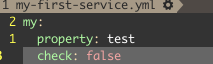
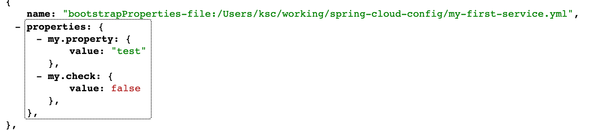

# 구성 관리
사람이 구성에 대해 수동으로 관리하면 다음과 같은 문제점이 발생
- 구성 편차(configuration drift)
- 예상하지 못한 장애
- 애플리케이션 확장 요구에 대한 시간 지연(lag-time)

### 애플리케이션 구성 관리를 위한 네가지 원칙
- 분리(segregate)
  - 애플리케이션 구성 정보와 서비스 인스턴스를 분리하여 배포
  - 구성 정보를 환경 변수로 전달하거나 중앙 저장소에서 읽어와야 함
- 추상화(abstract)
  - 구성 데이터의 접근 방식 추상화
  - 애플리케이션이 REST 기반의 JSON 서비스를 사용해 구성 데이터 조회
- 중앙 집중화(centralize)
  - 구성 정보를 보관하는 저장소 개수를 최소화 => 가능한 소수 저장소에 집중화
- 견고성(harden)
  -어떤 솔루션을 사용하더라도 고가용성과 다중성을 구현할 수 있어야 함

> 구성 데이터를 추적하고 버전 제어해야 함

## 구성 관리 아키텍처
1. 마이크로서비스가 시작되면 구성 서비스에 관한 정보를 읽어온다
2. 구성 서비스에서 구성 정보를 읽어온다
    - 실제 구성 정보는 저장소에 저장
3. 빌드 및 배포 파이프라인으로 구성 관리 변경
    - 변경된 구성은 버전 정보 태그를 달아 다른 환경에 배포 가능하게 함
4. 구성 관리가 변경되면 애플리케이션 구성 데이터를 사용하는 서비스는 변경 통보를 받고 보유한 애플리케이션 데이터 사본을 갱신

## 구현 선택
|프로젝트 이름|설명|특성|
|--|--|--|
|Etcd|Go언어로 작성된 오픈 소스 프로젝트<br>서비스 검색과 키-값 관리에 사용<br>분산컴퓨팅 모델용 Raft 프로토콜 사용|초고속이며 확장 가능<br>분산 가능<br>명령줄 위주<br>사용과 설치 용이
|Eureka|수 많은 실전 테스트 거침<br>서비스 검색과 키-값 관리에 사용|분산 키-값 저장소<br>유연하지만 설정하기 힘듬<br>동적 클라이언트 갱신 기능 제공|
|Consul|Etcd 및 유레카와 비슷한 기능 제공<br>분산컴퓨팅 모델에 다른 알고리즘 사용|빠르다<br>DNS와 직접 통합해 네이티브 서비스 검색 제공<br>동적 클라이언트 갱신 기능 미제공|
|Zookeeper|distributed locking 제공<br>키-값 데이터용 구성관리 솔루션|가장 오래되고 실전 경험이 많음<br>가장 사용하기 복잡함<br>구성 관리에 사용 가능하지만 이미 사용중인 경우에만 쓰는 것이 나음|
|Spring Cloud Config Server|다양한 백엔드와 함께 일반적인 구성 관리 솔루션 제공<br>Git, Eureka, Consul 등과 통합 가능|비분산 키-값 저장소<br>스프링 및 스프링이 아닌 서비스와 통합 가능<br>공유파일과 시스템, 유레카, 콘설, 깃 등 구성 데이터 저장을 위한 다양한 백엔드 사용 가능|

### Spring Cloud Config Server 사용 이유
- 쉬운 설치와 사용
- 스프링 부트와 긴밀히 통합되어 있음 => 간단한 어노테이션으로 사용 가능
- 구성 데이터를 저장할 수 있는 여러 백엔드 지원
- 깃과 통합시 다른 솔루션의 추가 의존성을 제거하고 구성 데이터를 손쉽게 버전 관리

# Spring Cloud Config Server 구축
## 파일 시스템을 이용한 컨피그 서버 활성화
### 의존성 추가
```xml
<properties>
  <spring-cloud.version>2021.0.0</spring-cloud.version>
</properties>

<dependencies>
  <dependency>
    <groupId>org.springframework.cloud</groupId>
    <artifactId>spring-cloud-config-server</artifactId>
  </dependency>
  <dependency>
    <groupId>org.springframework.boot</groupId>
    <artifactId>spring-boot-starter-actuator</artifactId>
  </dependency>
</dependencies>
<dependencyManagement>
  <dependencies>
    <dependency>
        <groupId>org.springframework.cloud</groupId>
        <artifactId>spring-cloud-dependencies</artifactId>
        <version>${spring-cloud.version}</version>
        <type>pom</type>
        <scope>import</scope>
    </dependency>
  </dependencies>
</dependencyManagement>
```

### 부트스트랩 클래스 설정
```java
@SpringBootApplication
@EnableConfigServer  // 추가
public class SpringConfigApplication {

    public static void main(String[] args) {
        SpringApplication.run(SpringConfigApplication.class, args);
    }

}
```

### application.yml 설정
```yml
server:
  port: 8888
spring:
  profiles:
    active: native
  cloud:
    config:
      server:
        native:
          search-locations: file://${user.home}/working/spring-cloud-config  # config file 이 저장된 디렉터리 위치

management:
  endpoints:
    web:
      exposure:
        include: health,refresh   # refresh 엔드포인트를 열어줌
```

### api 호출을 통해 config 확인
`http://localhost:8888/{config-name}/{profile}`
- config-name : 위에서 search-locations 에서 지정한 디렉터리 안에 {config-name}.yml 파일을 읽도록 함
- profile : 특정 profile 의 data 를 읽음
  - {config-name}-{profile}.yml 과 같은 형태로 지정 가능 => `config-dev.yml` 이면 `http://localhost:8888/config/dev`로 읽어올 수 있다
  - profile 이 default 가 아닐경우 해당 profile + default 를 읽어온다 => 해당하는 profile 이름의 파일이 없으면 default 만 읽어옴

## Git을 이용한 컨피그 서버 활성화
- 파일 시스템을 이용하면 설정 정보를 항상 모든 컨피그 서버의 인스턴스에서 파일을 복사해가야하는 등의 불편함이 있고, 파일 관리의 불편함이 있음
- git 을 이용하면 버전 관리와 빌드 및 배포 파이프라인을 통해 구성 파일을 배포하는 등의 이익이 있음

### application.yml
```yml
spring:
  cloud:
    config:
      server:
        git:
          uri: {repository 주소} 
          # private repository 일 경우 username, password 등 접속 정보를 기입해야 함
          # username: {사용자이름}
          # password: {비밀번호}
```

# Client 설정
### 의존성 추가
```xml
<properties>
  <spring-cloud.version>2021.0.0</spring-cloud.version>
</properties>

<dependencies>
  <dependency>
	  <groupId>org.springframework.cloud</groupId>
	  <artifactId>spring-cloud-starter-config</artifactId>
  </dependency>
  <!-- bootstrap.yml 구동 -->
  <dependency>
	  <groupId>org.springframework.cloud</groupId>
	  <artifactId>spring-cloud-starter-bootstrap</artifactId>
  </dependency>
</dependencies>

<dependencyManagement>
  <dependencies>
    <dependency>
      <groupId>org.springframework.cloud</groupId>
      <artifactId>spring-cloud-dependencies</artifactId>
      <version>{spring-cloud-version}</version>
      <type>pom</type>
      <scope>import</scope>
    </dependency>
  </dependencies>
</dependencyManagement>
```

### bootstrap.yml 설정
spring.cloud.config 설정을 하여 config server 정보를 알려준다
```yml
spring:
  cloud:
    config:
      uri: http://localhost:8888
  application:
    name: my-first-service
  profiles:
    active: default
```

[또다른 설정 추가](https://docs.spring.io/spring-cloud-config/docs/current/reference/html/#_spring_cloud_config_client)

### cli 로 전달
cli 로 실행하며 프로퍼티를 전달하여 cloud server 를 찾도록 할 수 있다
```bash
java -Dspring.cloud.config.uri=http://localhost:8888 \
     -Dspring.profiles.active=default \
     -jar {jarfile-name}.jar
```

## actuator 활성화로 endpoint 로 설정 정보 확인
### 의존성 추가
```xml
<dependency>
  <groupId>org.springframework.boot</groupId>
  <artifactId>spring-boot-starter-actuator</artifactId>
</dependency>
```

### 설정 정보를 endpoint 로 조회할 수 있게 설정 추가
```yml
# application.yml
management:
  endpoints:
    web:
      exposure:
        include: health,env   # env를 추가(health => 기본 헬스체크)
```

### endpoint 호출
`{client 주소}/actuator/env` 를 호출하면 config server 로부터 불러온 설정정보 + client 에서 설정한 설정정보를 볼 수 있음

- config server 구성 정보  


- endpoint 호출 결과 


## Config server 에서 받아온 설정 정보 사용
- 받아온 설정 정보는 client 의 application.yml 에 등록한 설정 정보와 같은 효과를 가짐
- @Value 어노테이션으로 사용가능
  ```java
  @Value("${my.property}")
  private String property;
  ```

## 받아온 설정 정보 갱신
설정 정보 갱신 방법은 세가지
- `/actuator/refresh` 호출
- Spring cloud bus 의 push 사용 => RabbitMQ 같은 미들웨어 필요
- 컨테이너 재시작 => 클라우드 기반의 컨테이너 사용의 이점 활용

애플리케이션이 시작될 때만 Config server 로부터 설정 정보를 받아오기 때문에 이것이 변경되어도 읽어오지 않는다. Config server 의 /refresh 엔드포인트를 호출하여 설정정보를 갱신할 수 있다.  
Config server 에 actuator 의존성과 refresh 엔드포인트를 열어주어야 한다.

> `/actuator/refresh` 는 POST 호출

### client refresh 설정
```java
@SpringBootApplication
@RefreshScope  // refresh 설정
public class FirstserviceApplication {
  public static void main(String[] args) {
    SpringApplication.run(FirstserviceApplication.class, args);
  }
}
```

- `@RefreshScope`은 사용할 Bean 에 명시적으로 붙여주는 것이 더 좋을 것 같음
[참고](https://stackoverflow.com/questions/56833080/refreshscope-in-configuration-class)

