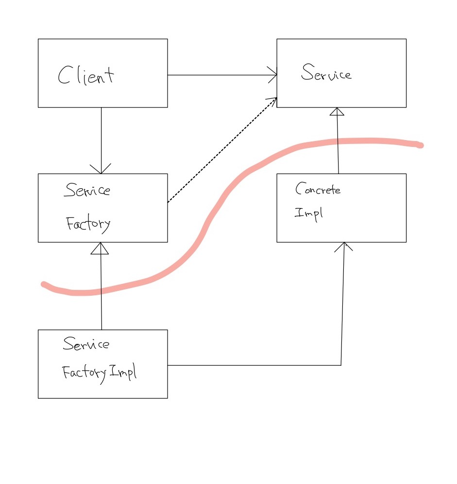

# 서문
좋은 소프트웨어 시스템은 clean code 로부터 시작  
모듈 수준에서 SOLID 적용

## SOLID 원칙의 목적
- 변경에 유연
- 이해하기 쉬움
- 많은 소프트웨어 시스템에 사용될 수 있는 컴포넌트의 기반

# SRP : 단일 책임 원칙
단 하나의 일만 해야한다는 원칙은 함수에 적용되는 것 => 이것은 SRP 가 아님

## 정의
하나의 모듈은 오직 하나의 액터에 대해서만 책임져야 한다
- 모듈 : 가장 단순한 정의는 소스 파일
- 응집성(`cohesion`) : 단일 액터를 책임지는 코드를 함께 묶어주는 힘

> SRP 는 서로 다른 액터가 의존하는 코드를 서로 분리하라고 한다

## 결론
- 단일 책임 원칙은 메서드와 클래스 수준의 원칙이지만 더 상위의 수준에서도 다른 형태로 등장
하나의 액터에 대해 책임지기 위해 public interface 가 적을수록 응집도가 올라간다고 생각된다.  
따라서 public method 를 하나만 가지는 것이 이상적이라고 생각은 되지만, 현실적으로는 반드시 지킬만한 원칙은 아닌 것 같다.  
책에서는 각 클래스 자체가 하나의 유효범위가 된다고 설명한다.

# OCP : 개방 - 폐쇄 원칙
소프트웨어 개체는 확장에는 열려 있어야 하고, 변경에는 닫혀 있어야 한다  
- 소프트웨어 개체의 행위는 확장할 수 있어야 하지만 이때 개체를 변경하지 않아야 한다
- 소프트웨어 아키텍처를 공부하는 가장 근본적인 이유
- 아키텍처 컴포넌트 수준에서 OCP 를 고려할 때 훨씬 중요한 의미를 지님

## 보호의 계층구조
- A 컴포넌트에서 발생한 변경으로부터 B 컴포넌트를 보호하려면 반드시 A 컴포넌트가 B 컴포넌트에 의존해야 한다
- 보호의 계층구조는 level 개념을 바탕으로 생성될 수 있는 데, 가장 높은 수준의 개념이 최고의 보호를 받고, 낮은 수준의 개념일 수록 보호를 받지 못한다.
- 컴포넌트 계층구조를 조직화하면 저수준 컴포넌트에서 발생한 변경으로부터 고수준 컴포넌트를 보호할 수 있다.

## 정보은닉
추이 종송석을 가지게 되면 `자신이 직접 사용하지 않는 요소에는 절대로 의존해서는 안된다`는 소프트웨어 원칙을 위반하게 됨

## 결론
시스템을 컴포넌트 단위로 분리하고, 저수준 컴포넌트에서 발생한 변경으로부터 고수준 컴포넌트를 보호할 수 있는 형태의 의존성 계층구조를 만들어야 한다.  
이를 위해 DIP 와 같은 기법을 사용하여 의존성을 끊어내고, 컴포넌트들이 서로 영향을 받지 않도록 추상적인 인터페이스에 의존하도록 하여 의존성의 방향을 바꿔야 한다.

# LSP : 리스코프 치환 원칙
A객체를 B객체로 치환하더라도 해당 프로그램에서 `행위`가 변경되지 않으면 B는 A의 하위 타입이다.  
객체를 사용하는 액터의 행위가 사용하는 타입 자체에 의존하면 타입을 치환할 수 없게 된다.

## 결론
LSP는 아키텍처 수준까지 확장해야한다.  
치환 가능성을 조금이라도 위배하면 시스템 아키텍처가 오염되어 상당량의 별도 메커니즈므을 추가해야 할 수 있기 때문이다.

# ISP : 인터페이스 분리 원칙
ISP는 언어 종류에 따라 영향받는 정도가 다르다.  
일반적으로 필요 이상으로 많은 걸 포함하는 모듈에 의존하는 것은 해로운 일이다.

## 결론
불필요한 의존이 생기면 예상하지 못한 문제에 빠질 수 있기 때문에 인터페이스를 잘 분리하여야 한다.

# DIP : 의존성 역전 원칙
의존성 역전 원칙에서 말하는 유연성이 극대화된 시스템이란 소스 코드 의존성이 추상에 의존하며 구체에는 의존하지 않는 시스템이다.  
현실적으로 항상 지키기 어렵다.  
안정성이 보장된 플랫폼이나 운영체제에 대해서는 DIP를 무시하는 편이다. 이는 변경되지 않는다면 의존할 수 있다는 사실을 이미 알고 있기 때문이다. => String 과 같은 클래스를 그냥 사용하는 것과 같은 경우  
의존하지 않도록 피하고자 하는 것은 변동성이 큰 구체적인 요소이다.(개발중인 모듈)

## 안정된 추상화
- 인터페이스는 구현체보다 변동성이 낮다
- 안정된 아키텍처란 변동성이 낮은 인터페이스에 의존하는 것
- 안정된 추상화를 위한 코딩 실천법
  - 변동성이 큰 구체 클래스를 참조하지 말라
    - 객체 생성방식을 강하게 제약 => 추상팩토리 사용
  - 변동성이 큰 구체 클래스로부터 파생하지 말라
    - 상속을 신중히 사용
  - 구체 함수를 오버라이드 하지 말라
    - 추상함수로 선언하고 구현체들에서 용도에 맞게 구현하는 방법 사용
  - 구체적이며 변동서이 크다면 그 이름을 언급하지 말라

## 팩토리
의존성 관리를 위해 추상팩토리 패턴 사용
```java
public class Application {
  public static void main(String[] args) {
    final Client client = new Client(new ServiceFactoryImpl());
    client.startApp();
  }
}

class Client {
  private final ServiceFactory factory;

  public Client(ServiceFactory factory) {
    this.factory = factory;
  }

  void startApp() {
    final Service service = factory.makeService();
    service.run();
  }
}

interface Service {
  void run();
}

class ConcreteImpl implements Service {
  @Override
  public void run() {
    System.out.println("run concrete");
  }
}

interface ServiceFactory {
  Service makeService();
}

class ServiceFactoryImpl implements ServiceFactory {
  @Override
  public Service makeService() {
    return new ConcreteImpl();
  }
}
```



빨간 곡선은 시스템을 두 가지 컴포넌트로 분리 => 추상 컴포넌트와 구체 컴포넌트
- 소스 코드 의존성은 해당 곡선과 교차할 때 모두 한 반향, 즉 추상적인 쪽으로 향한다

## 구체 컴포넌트
DIP 위배를 모두 없앨 수 없지만 DIP를 위배하는 클래스들은 적은 수의 구체 컴포넌트 내부로 모을 수 있고, 이를 통해 시스템의 나머지 부분과는 분리할 수 있다  
이를 Main 컴포넌트라고 부른다
