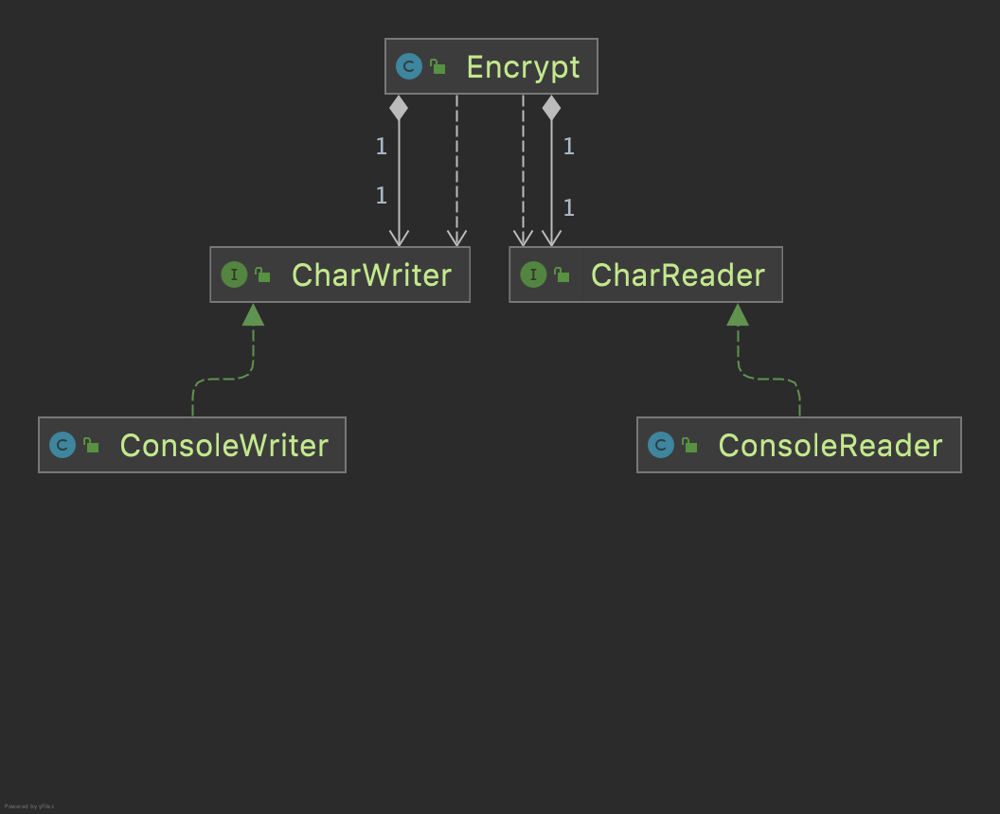

# 아키텍처란
소프트웨어 아키텍트는 프로그래머이며 코드와 동떨어져서는 안된다.  
프로그래밍 작업뿐만 아니라 다른 팀원들이 생산성을 극대화 할 수 있는 설계를 하도록 방향을 이끌어야 한다.  
소프트웨어 시스템의 아키텍처란 시스템을 구축했던 사람들이 만들어낸 시스템의 형태이며 컴포넌트로 분할하는 방법, 분할된 컴포넌트를 배치하는 방법, 컴포넌트가 서로 의사소통하는 방식에 따라 정해진다.  
시스템 아키텍처는 시스템의 동작 여부와는 거의 관련이 없다.  
아키텍처의 주된 목적은 시스템의 생명주기를 지원하는 것이고, 시스템을 쉽게 이해하고 개발하고 유지보수하고 배포하게 한다.  
**궁극적인 목표는 시스템 수명과 관련된 비용을 최소화하고 생산성을 최대화하는 데 있다**

## 개발
팀 구성원과 팀의 구조에 따라 아키텍처를 선택해야 한다  
구성원의 수가 적으면 아키텍처 관련 제약들이 오히려 방해가 될 수 있고, 구성원의 수가 많아지기 시작하면 잘 설계된 컴포넌트 단위로 분리하지 않으면 개발 생산성이 하락할 수 있다

## 배포
- 배포 비용이 높을수록 시스템의 유용성 하락
  - 시스템을 단 한번에 쉽게 배포할 수 있도록 만들어야 함

## 운영
운영을 방해하는 아키텍처가 개발, 배포, 유지보수를 방해하는 아키텍처보다는 비용이 낮음

## 유지보수
유지보수의 가장 큰 비용은 탐사`spelunking`와 이로 인한 위험부담
  - 탐사 : 기존 소프트웨어에 새로운 기능을 추가하거나 결함 수정시 소프트웨어의 어디를 고치는 게 최선인지, 어떤 전략을 쓰는게 최적일지 결정할 때 드는 비용
  - 변경사항 반영시 의도치 않은 결함이 발생할 가능성은 항상 있고, 이로 인해 위험부담 비용이 추가된다

## 선택사항 열어두기
중요하지 않은 세부사항은 가능한 많이, 오래도록 열어두어야 한다 => 결정하지 않아야 한다
- 소프트웨어 시스템은 두 가지 구성요소로 분해 가능 : 정책`policy`, 세부사항`detail`
  - 정책 : 시스템의 진정한 가치가 살아있는 곳
  - 세부사항 : 사람, 외부 시스템, 프로그래머 등이 정책과 소통시 필요한 요소지만 정책의 행위에 영향을 미치지 않음
    - 입출력장치, 데이터베이스, 웹 시스템, 서버, 프레임워크, 통신프로토콜 등등
- 아키텍트의 목표는 시스템에서 정책을 가장 핵심적 요소로 식별 + 세부사항을 정책에 무관하게 만들 수 있는 형태의 시스템 구축
  - 세부사항에 정책이 영향을 받지 않도록 세부사항을 잘 추상화한다. 예를 들면 스프링의 서비스 추상화와 같이 구체적인 사항에 의존할 필요가 없도록 만들어야 한다

**좋은 아키텍트는 결정되지 않은 사항의 수를 최대화한다**

## 결론
좋은 아키텍트는 세부사항을 정책으로부터 신중히 가려내고, 결합되지 않도록 엄격하게 격리하여, 정책이 세부사항에 대해 어떠한 지식도 갖지 않게 하여 의존하지 않도록 해야 한다

# 독립성
좋은 아키텍처가 지원해야 하는 것
  - 시스템의 유스케이스
  - 시스템의 운영
  - 시스템의 개발
  - 시스템의 배포

## 유스케이스
시스템의 아키텍처는 시스템의 의도를 지원해야 함  
좋은 아키텍처를 가진다면 시스템의 구조에서 의도가 드러나고 행위 자체를 설명하는 이름을 갖게 되어 파악하기 쉬운 시스템이 된다

## 운영
아키텍처에서 각 컴포넌트를 잘 격리하고 컴포넌트끼리의 통신방식을 제한하지 않도록 구성하면 운영에 필요한 요구사항이 변경되더라도 기술 스펙트럼을 전환하기 쉬워진다

## 개발
콘웨이의 법칙 작용
> 시스템을 설계하는 조직이라면 어디든지 그 조직의 의사소통 구조와 동일한 구조의 설계를 만들어 낼 것이다

각 팀이 독립적으로 행동하기 편한 아키텍처를 확하하여 개발하는 동안 팀간의 독립성을 보장하여야 한다

## 배포
아키텍처는 배포 용이성을 결정하는 데 중요한 역할을 하는 데, 목표를 즉각적인 배포로 잡아야 한다  
시스템이 빌드된 후 즉각 배포할 수 있도록 지원해야 하나다

## 선택사항 열어놓기
선택사항을 열어두어 향후 시스템에 변경이 필요할 때 어떤 방향으로든 쉽게 변경할 수 있도록 해야한다  
우리가 도달하려는 목표는 뚜렷하지 않고 항상 변화하고, 몇가지 아키텍처 원칙을 지킴으로써 시스템의 컴포넌트들을 독립적으로 격리하여 선택사항을 열어둘 수 있도록 한다

## 계층 결합 분리
맥락에 따라서 다른 이유로 변경되는 것들은 분리하고, 동일한 이유로 변경되는 것들은 묶는다  
업무 규칙은 애플리케이션과 밀접한 관련이 있거나, 혹은 더 범용적일 수 있다  
따라서 애플리케이션 자체와 밀접하게 관련된 업무규칙, 업무 도메인에 더 밀접한 업무 규칙 등은 서로 다른 속도로 변경될 수 있다.  
UI, 애플리케이션에 특화된 업무규칙, 애플리케이션과는 독립적인 업무규칙, 데이터베이스 등을 수평적인 계층으로 나누어야 한다.

## 유스케이스 결합 분리
유스케이스는 시스템을 분할하는 매우 자연스러운 방법
  - 각 유스케이스는 다른 속도로 변경된다
  - 주문 추가와 주문 삭제는 다른 속도로 변경되는 유스케이스이다
유스케이스는 시스템의 수평적인 계층을 가로지르도록 수직으로 자른 조각과도 같다  
유스케이스들이 각 수평적 계층에서 서로 겹치지 않도록 해야한다

## 중복
소프트웨어에서 중복은 일반적으로 나쁜 것이다  
중복에는 두 가지 종류가 있는 데, 진짜 중복과 거짓된(우발적) 중복이다  
  - 두 코드의 영역이 각자의 경로로 발전한다면, 즉 서로 다른 속도와 다른 이유로 변경된다면 진짜 중복이 아니다
  - 코드가 중복된 것처럼 보이지만 중복된 경우가 아닐 수 있다. 같거나 비슷한 모양의 코드라 하더라도 다른 속도로 변경될 수 있다면 중복이 아닐 수 있다

중복이 진짜 중복인지 확인하라  
데이터 베이스 레코드를 그대로 UI까지 전달하는 것과 같은 것은 거의 확실히 우발적인 중복이다
  - 뷰 모델을 별도로 UI마다 만드는 것이 계층간 결합을 방지하는 데 더 좋다

## 결합 분리 모드
- 소스 수준 분리 모드
  - 소스 코드 모듈 사이의 의존성을 제어할 수 있다
  - 하나의 모듈이 변해도 다른 모듈을 변경하거나 재컴파일 하지 않음(루비, Gem)
  - 모든 컴포넌트가 같은 주소 공간에서 실행
  - 함수 호출로 통신
  - 모노리틱 구조
- 배포 수준 분리 모드
  - 배포 가능한 단위들 사이의 의존성을 제어할 수 있다
  - 한 모듈이 변해도 다른 모듈들이 재빌드나 재배포를 하지 않음(jar, DLL, 공유라이브러리)
  - 많은 컴포넌트가 같은 주소 공간에서 실행
  - 함수 호출로 통신
  - 동일한 프로세서에서 상주할 수도 있고, 프로세스 간 통신, 소켓, 공유메모리를 통해 통신
  - 독립적으로 배포 가능한 단위로 분할되어 있다
- 서비스 수준 분리 모드
  - 의존하는 수준을 데이터 구조 단위까지 낮출 수 있다
  - 네트워크 패킷을 통해서만 통신
  - 모든 실행 가능한 단위는 소스와 바이너리 변경에 대해 서로 완전히 독립적(서비스 또는 마이크로서비스)

## 결론
처음에는 서비스 수준 분리가 되기 직전까지 모듈들을 분리해두고, 서비스가 확장됨에 따라 판단하여 서비스 수준 분리 모드로 변경할 수 있도록 아키텍처를 설계하는 것이 좋다.  
다시 상황이 바뀌었을 때 진행 방향을 거꾸로 되돌려 모노리틱 구조로 되돌릴 수도 있어야 한다.  
이렇게 바꾸는 것이 쉽지는 않으나 시스템의 결합 분리 모드는 시간이 지남에 따라 항상 변경될 수 있다는 것을 염두에 두고 변경에 대해 예측하여야 한다.

# 경계 : 선 긋기
경계`boundary`는 소프트웨어 요소를 분리하고 분리된 경계밖의 요소에 대해서는 알지 못하도록 막는다.  
경계는 프로젝트 초기에 그을수도 매우 나중에 그어질 수도 있다.  
너무 일찍 내려진 결정에 따른 결합`coupling`은 인적 자원의 효율을 떨어뜨린다.

## 경계에 대한 결정 요소
- 경계를 긋는 행위는 결정을 유보하는 데 도움이 되고, 결합도를 낮춰 리소스 낭비를 막는다
  - 업무 규칙과 연관이 없는 repository 와 같은 외부 요소들은 최대한 결정을 늦춰도 된다
  - 위와 같은 경계를 만들게 되면 상당한 오버엔지니어링의 결과가 나타날 수도 있다고 생각한다
- 관련이 있는 것과 없는 것 사이에 선을 긋는다
- 데이터베이스는 업무 규칙이 간접적으로 사용할 수 있는 도구
  - 데이터베이스와 같은 요소는 업무 규칙을 구현하는 곳에서는 알 필요가 없다 => 추상화된 인터페이스를 통해 사용
- 인터페이스는 모델에게 있어 중요하지 않다. 중요한 것은 업무 규칙이다.
  - 입/출력과 같은 요소는 중요하지 않다. 경계를 잘 지어야 한다

## 결론
- 소프트웨어 아키텍처에서 경계선을 그리려면 먼저 시스템을 컴포넌트 단위로 분할
- 핵심 업무 규칙, 플러그인으로 분리
- 컴포넌트 사이의 의존성 화살표는 항상 핵심 업무 규칙으로 향해야 한다
  - 핵심 업무 규칙 컴포넌트 내부에 플러그인으로 사용할 컴포넌트의 인터페이스를 두고, 플러그인은 이를 구현하는 형태로 작성되어야 한다
  - 이를 통해 의존성 화살표는 저수준 세부사항에서 고수준 추상화를 향한다

# 경계 해부학
- 경계는 변경이 전파되는 것을 막는 방화벽을 구축하고 관리하는 수단
- 소스 코드 모듈 하나가 변경되면 의존하는 모든 모듈을 새로 컴파일 해야된다거나 하는 것을 방지하기 위해 경계를 나눠야 함

## 아키텍처의 경계
### 단일체
- 가장 단순한 형태의 경계 횡단 : 저수준 클라이언트 -> 고수준 서비스 호출
  - 런타임과 컴파일타임 의존성이 동일
  - 제어흐름과 반대 방향으로 의존성을 역전시켜 런타임과 컴파일타임 의존성을 반대로 바꾼다
- 경계를 횡단할때 의존성은 고수준 컴포넌트로 향해야 한다

### 배포형 컴포넌트
- 동적 링크 라이브러리 사용 : DLL, jar, GEM 등등
- 통신방법 : 함수 호출 (값싼 호출)

### 스레드
- 단일체와 배포형 컴포넌트는 모두 스레드 활용 가능
- 아키텍처의 경계나 배포의 단위로 볼 수 없음
- 실행 계획과 순서를 체계화 하는 방법에 가깝다

### 로컬 프로세스
- 강한 물리적 형태를 띠는 아키텍처 경계
- 소켓, 메일박스, 메시지 큐와 같이 운영체제에서 제공하는 통신 기능 사용
- 고수준 프로세스의 코드가 저수준 프로세스에 대해 알아서는 안됨

### 서비스
- 물리적 형태를 띠는 가장 강력한 경계
- 모든 통신이 네트워크(값비싼 호출)

> 서비스는 논리적으로(혹은 물리적으로) 각각 다른 머신에 존재하고, 로컬 프로세스는 논리적으로 같은 머신에 존재

# 정책과 수준
- 소프트웨어 시스템은 정책을 기술한 것
- 서로 다른 이유/다른 시점에 변겨오디는 정책은 다른 수준과 컴포넌트로 분리
- 저수준 컴포넌트가 고수준 컴포넌트에 의존하도록 설계
- 자바의 경우 import 구문으로 소스코드 의존성을 확인

## 수준
- 수준`level` : 입력과 출력까지의 거리
  - 입/출력으로부터 거리가 멀면 정책의 수준이 높아짐
  - 이렇게만 설명하면 일반적으로 익숙하게 사용하는 MVC 패턴에서 생각해 볼 경우에는 데이터베이스 관련이 가장 고수준으로 판단할 수 있지만, DB IO 도 입출력이다. 그러므로, 흔히 공부하는 MVC layer architecture 기준으로 설명하면 Service layer 가 가장 고수준이라고 말할수도 있다.
    - 이 책에서는 Service layer 보다는 Use case 로 설명하는 데, 저자가 말하는 것은 형식적인 layered architecture 와 같은 관점이 아닌 adapter 와 port 같은 형태의 관점에서 이야기 한다고 생각된다
- 소스 코드 의존성은 그 수준에 따라 결합 => 데이터 흐름을 기준으로 결합되어서는 안됨
- 경계를 횡단하는 의존성은 모두 경계 안쪽으로 향해야 함

- 의존성을 역전시켜 추상적인 것에 의존하도록 한다
- ConsoleReader, ConsoleWriter 는 IO 를 직접 담당하기 때문에 저수준이다
- 위의 방식을 통해 저수준의 입/출력을 암호화 정책으로부터 분리시켰다
- 이런 분리를 통해 입/출력의 세부사항이 변하더라도 암호화 정책은 전혀 영향을 받지 않는다
- 즉, 변경의 영향도를 줄인다

# 업무 규칙
- 핵심 업무 규칙 : 사업적으로 수익을 얻거나 비용을 줄일 수 있는 규칙
  - 보통 데이터를 요구 => 핵심 업무 데이터
- 엔티티 : 핵심 규칙과 데이터는 본질적으로 결합되있기 때문에 이것을 객체로 만들면 엔티티가 된다

## 엔티티
- 정의 : 컴퓨터 시스템 내부의 객체, 핵심 업무 데이터를 기반으로 동작하는 일련의 조그만 핵심 업무 규칙을 구체화
- 외부적인 요인으로 오염되어서는 안됨 => DB, UI, third party framework ...
- 어떠한 시스템에서도 업무 수행이 가능
- 순전히 업무에 대한 순수한 객체

## 유스케이스
- 정의 : 자동화된 시스템이 사용되는 방법
- 애플리케이션에 특화된`application-specific` 업무 규칙 설명
- 사용자가 제공해야하는 입력, 사용자에게 보여줄 출력, 해당 출력을 생성하기 위한 처리 단계를 기술
  - 하지만 시스템이 사용자에게 어떻게 보이는 지 설명하면 안됨
- 엔티티의 제어를 담당
  - 엔티티의 입장에서는 자신을 제어하는 유스케이스에 대해서는 알지 못해야 한다
  - 엔티티는 가장 안쪽에 위치한 중요 업무 규칙이기 때문에 같은 수준의 업무 규칙을 제외한 어떤 객체도 알아서는 안된다
  - 따라서, 엔티티는 가장 고수준의 객체이고, 상대적으로 유스케이스는 저수준이다 => 유스케이스는 단일 애플리케이션에 특화된 업무 규칙이기 때문이다
- 유스케이스 클래스의 코드는 HTML이나 SQL같은 코드에 알아서는 안된다
  - 단순한 요청 데이터 구조를 입력으로 받고, 단순한 응답 데이터 구조를 출력으로 반환한다
  - 웹, console 등 어떠한 요소로부터 데이터가 전달되는지 알아서는 안된다 => 의존하여서는 안된다
- 의존성을 제거하는 일은 매우 중요하다 => 변경 전파를 막을 수 있다

## 결론
업무 규칙은 소프트웨어 시스템의 가장 핵심이고, 외부 요인으로 인해 오염되서는 안되는 순수하게 남아야 하는 존재라고 책에서는 설명한다.  
이 책에서 저자는 순수하게 이상적인 아키텍처에 관해 설명하기 위해 이러한 표현들을 썼다라고 생각이 드는데, 스터디 팀원들과도 토론을 나누어 봤지만, 트레이드오프라고 생각이 든다.  
JPA 의 Entity를 예로 생각해보아도 이상적으로 보면 JPA에 대한 기술의존성 분리를 위해 JPA의 Entity와 아키텍처적인 Entity를 분리해야 할 것으로 생각된다.  
하지만, 그렇게 분리하게 되면 코드량이 상당히 늘어나게 될 것이고, 이로 인해 생산성 저하나 엔티티를 변환하는 과정의 코드로 오히려 혼란을 초래할 수 있다고 생각한다.  
따라서, 이상은 책에서 나오는 것처럼 외부 요소들과 분리를 생각하고, 현실적으로는 생산성과 유지보수성을 생각하여 적절히 타협하는 자세를 가져야 한다고 생각한다.

# 소리치는 아키텍처
디렉터리 구조, 최상위 패키지의 소스를 보고 어떤 업무를 하는 애플리케이션인지 알 수 있는 아키텍처를 지향해야 한다

## 아키텍처의 테마
- 아키텍처를 프레임워크로부터 제공받아선 안된다
- 유스케이스를 중심으로 아키텍처를 구성해야 한다

## 아키텍처의 목적
- 좋은 아키텍처는 유스케이스를 중심에 둔다
- 환경에 구애받지 않고 유스케이스를 지원하는 구조를 아무런 문제 없이 기술해야 함
- 유스케이스에 중점을 두고, 지엽적 관심사에 대한 결합을 분리
  - 프레임워크, 데이터베이스, 웹서버, 기타 개발 환경 문제나 도구에 대한 결정을 미룰 수 있어야 함
- 웹은 단지 IO장치 일뿐

## 테스트하기 쉬운 아키텍처
- 프레임워크에 의존적이지 않게 모든 유스케이스에 대해 단위테스트를 수행할 수 있어야 함
- 웹 서버나 데이터베이스 등에 연결되어 있지 않아도 테스트를 할 수 있어야 함
- 엔티티를 POJO로 만들고 외부 요소들에 의존적이지 않게 해야 함

# 클린 아키텍처
관심사의 분리를 위한 아키텍처 아이디어
- Hexagonal Architecture : 포트와 어댑터 패턴 [함께 읽어보면 좋은 글](https://engineering.linecorp.com/ko/blog/port-and-adapter-architecture/?fbclid=IwAR2QzD03fcFvo7AgjWnpQX9hgpd6vMKUCKFwX-6m2jEhHBdkR6OD5ONjPzs)
- DCI`Data,Context and Interaction`
- BCE`Boundary-Control-Entity`

위의 아키텍처를 기반으로 설계한 소프트웨어가 가지는 특징
- 프레임워크 독립성
- 테스트 용이성
- UI 독립성
- 데이터베이스 독립성
- 모든 외부 에이전시에 대한 독립성

## 의존성 규칙

- 바깥쪽 원은 메커니즘, 안쪽 원은 정책
- 의존성 규칙이 가장 중요 => 소스 코드 의존성은 반드시 안쪽으로(저수준 -> 고수준 정책)
- 내부의 원은 외부의 원에 대한 어떤 것도 알지 못해야 한다
  - 외부의 원에 선언된 데이터 형식조차도 사용하면 안된다
  - 이를 회피하는 방법으로 내부의 원에서 데이터 형식에 대한 interface를 정의하고 외부의 원에서 이를 구현하도록 한다

### 엔티티
- 전사적인 핵심 업무 규칙 캡슐화하는 객체
- 가장 일반적이고 고수준인 규칙을 캡슐화
- 외부의 요소가 변경되어도 엔티티가 영향을 받지 않아야 한다

### 유스케이스
- 애플리케이션에 특화된 업무 규칙 포함
- 시스템의 모든 유스케이스를 캡슐화 및 구현
- 유스케이스는 엔티티로 들어오고 나가는 데이터 흐름을 조정하고, 엔티티가 자신의 핵심 업무 규칙을 사용하여 유스케이스의 목적을 달성하도록 한다
- 운영 관점에서 애플리케이션이 변경되면 유스케이스는 영향을 받을 수 있다

### 인터페이스 어댑터
- 일련의 어댑터로 구성
- GUI의 MVC 아키텍처 모두 포함
- Presenter, View, Controller, Database과 관련된 부분(SQL, ORM 등등)

### 프레임워크와 드라이버
- 모든 세부사항이 위치
- 웹, 데이터베이스 등등

> 원은 꼭 네개가 아니어도 된다. 의존성에 대한 규칙만 염두에 두면 된다.

### 경계 횡단
- 제어흐름과 의존성의 방향이 반대여야 하는 경우 의존성 역전 원칙을 이용하여 해결
  - 소스코드 의존성을 제어흐름과 반대가 되게 만듬
- 아키텍처 경계를 횡단할때도 이와 같은 기법을 사용

[참고](https://github.com/pch8388/study-java-base/tree/master/study-java/src/main/java/architecture/ex)

## 결론
소프트웨어 계층을 분리하고 의존성 규칙을 준수하여 테스트하기 쉽고 외부의 변경에 강한 소프트웨어를 작성하도록 노력하자

# 프레젠터와 험블 객체
- 험블 객체 패턴 : 테스트하기 어려운 행위와 테스트하기 쉬운 행위를 단위 테스트 작성자가 분리하기 쉽게 하는 방법
  - 행위를 두 개의 모듈이나 클래스로 나누어서 테스트하기 어려운 행위를 모두 험블 객체로 옮긴다

## 프레젠터와 뷰
험블 객체 패턴을 이용하여 GUI 와 같이 테스트하기 힘든 환경을 테스트하기 쉬운 부분과 어려운 부분으로 분리한다
- 뷰 : 험블 객체, 실제로 GUI 등에서 데이터가 어디에 배치될지 등을 결정
- 프레젠터 : 애플리케이션으로부터 데이터를 받아 화면에 표현할 수 있는 포맷으로 변경

## 데이터베이스 게이트웨이
- 유스케이스에서 데이터베이스에 직접적으로 연관되지 않기 위해 데이터베이스 게이트웨이와 같은 인터페이스를 사용
- 인터페이스는 유스케이스 계층, 인터페이스 구현체는 데이터베이스 계층에 위치시킴
- 따라서 유스케이스 계층은 테스트하기 쉬워진다
  - 데이터베이스에 관해서는 인터페이스만 사용하기 때문에 인터페이스를 `stub`, `test-double` 처리할 수 있음

## 데이터 매퍼
- ORM 은 존재하지 않는다 => 객체는 데이터 구조가 아니기 때문
  - 객체를 사용하는 관점에서는 객체는 data structure 가 아니다
  - 사용의 관점에서 보았을 때는 데이터는 캡슐화되어 있고 행위만 드러나있기 때문에 단순한 오퍼레이션 집합으로 보인다
  - 따라서 ORM 보다 데이터 매퍼라고 부르는 것이 합당하다
- ORM 은 데이터베이스 계층에 존재해야 함
  - ORM 은 게이트웨이 인터페이스와 데이터베이스 사이에서 일종의 또 다른 험블 객체 경계를 형성

## 결론
아키텍처의 경계에서 험블 객체 패턴을 사용하면 전체 시스템에서 테스트를 쉽게 할 수 있다

# 부분적 경계
아키텍처의 경계를 완벽하게 만들기 위해서는 경계별로 의존성을 위한 많은 비용이 드는 데, 이것은 YAGNI`You Aren't Going to Need It` 원칙을 위배한다.  
부분적 경계를 통해 모든 경계마다 비용이 발생하는 것을 방지할 수 있다

## 부분적 경계 만들기
### 마지막 단계 건너뛰기
독립적으로 컴파일하고 배포할 수 있는 컴포넌트를 만들기 우한 작업을 모두 수행하고 단일 컴포넌트에 그대로 모아만 둔다
  - 쌍방향 인터페이스, 입/출력 데이터 구조 같은 것들을 하나의 컴포넌트에 두고 컴파일해서 배포
  - 소스 코드의 양에서는 큰 차이가 없지만 다수의 컴포넌트를 관리하는 부담을 줄여줌

### 일차원 경계
쌍방향 인터페이스가 아닌 단방향으로만 인터페이스를 사용한다
  - 이러한 방법은 클라이언트가 인터페이스가 아닌 구현체를 직접 사용하는 것을 막을 수 없는 단점이 존재한다

### 퍼사드
경계를 Facade 클래스로만 간단히 정의하고, Facade 클래스에는 모든 서비스 클래스를 메서드 형태로 정의하고 서비스 호출이 발생하면 해당 서비스 클래스로 호출을 전달
  - 클라이언트가 모든 서비스 클래스에 대해 `추이 종속성`을 갖게 된다
  - 일차원 경계와 마찬가지로 클라이언트가 구현체를 직접 사용할 수 있는 단점이 존재한다

> 추이 종속성 : A -> B -> C 로 의존성이 흐르면 A는 C에 대해 추이 종속성을 가진다

## 결론
위의 세가지 부분적 경계 만들기에도 단점이 모두 존재하고, 경계마다 쌍방향 인터페이스를 만드는 것 또한 많은 비용이 드는 단점이 있다  
상황에 따라 충분한 논의를 통해 어떠한 아키텍처를 선택할지 고민해보아야 한다

# 계층과 경계
- 아키텍처 경계는 어디에나 존재한다
- 경계를 제대로 구현하려면 비용이 많이 든다
- 경계가 무시되었다면 나중에 다시 추가하는 비용이 크다
- 추상화가 필요하리라고 미리 예측해서는 안된다
  - 오버엔지니어링은 언더엔지니어링보다 나쁠 때가 훨씬 많다
  - 경계가 필요하다는 것을 추후에 발견한다면 매우 큰 비용을 지불하고 경계를 나눌 수 있다
- 이러한 상황에서 경계를 어떻게 분리할지를 결정해야 하는 것은 굉장히 어려운 일이다
- 경계가 필요할 수 있는 부분에 항상 주목하고 경계가 존재하지 않아 생기는 마찰의 어렴풋한 첫 조짐을 신중하게 관찰해야 한다

# 메인 컴포넌트
- 메인 컴포넌트는 궁극적인 세부사항 => 가장 낮은 수준의 정책
- 시스템의 초기 진입점 (운영체제만 의존)
- 시스템 전반을 담당하는 나머지 기반을 생성(factory, strategy)한 후, 시스템에서 더 높은 수준을 담당하는 부분으로 제어권을 넘김
- 클린 아키텍처의 가장 바깥 원에 존재하는 저수준 모듈

## 결론
애플리케이션의 플러그인으로 여기고, 여러가지 플러그인으로 바꿔끼울 수 있다는 개념으로 접근하면, 개발/테스트/운영 등의 영역별 메인 플러그인을 만들 수 있다

# 크고 작은 모든 서비스들
## 서비스 아키텍처
- 서비스 그 자체로는 아키텍처를 정의하지 않음
- 서비스는 프로세스나 플랫폼 경계를 가로지르는 함수 호출
- 각 서비스는 프로세스나 네트워크 상의 공유 자원 때문에 결합될 가능성이 있다
  - 공유하는 자원의 데이터가 변경된다면 해당 자원을 사용하는 서비스들이 영향을 받을 가능성이 있다
  - 이와 같은 측면에서 본다면 함수 인터페이스보다 서비스의 인터페이스가 더 변경의 가능성이 적다고 할 수 없다
- 데이터나 행위에 대해 외부 서비스와의 연계를 고려한다면 항상 배포독립적으로 개발되고 운영된다고 보기 힘들다
  - 횡단 관심사가 지닌 문제
  - 객체 지향 방식으로 횡단 관심사를 처리할 수 있다 => 컴포넌트를 분리하여 template method 패턴이나 strategy 패턴 등을 이용

### 컴포넌트 기반 서비스
- 서비스는 SOLID 원칙대로 설계할 수 있고, 컴포넌트 구조를 갖출 수 있음
  - 기존의 컴포넌트를 변경하지 않고 새로운 컴포넌트를 추가할 수 있다

## 결론
시스템의 아키텍처는 시스템 내부에 그어진 경계와 경계를 넘나드는 의존성에 의해 정의

# 테스트 경계
테스트는 시스템의 일부이며 아키텍처에도 관여

## 시스템 컴포넌트인 테스트
- 여러 종류의 테스트가 있지만 아키텍처 관점에서는 모든 테스트가 동일
- 테스트는 태생적으로 의존성 규칙을 따름
- 테스트는 세부적이며 구체적이고, 의존성은 항상 테스트 대상이 되는 코드를 향함
- 테스트는 항상 원의 안쪽을 의존
- 테스트는 시스템 컴포넌트 중 가장 고립되어 있음

## 테스트를 고려한 설계
- 깨지기 쉬운 테스트 문제`Fragile Tests Problem` : 시스템의 공통 컴포넌트가 변경되면 수많은 테스트가 망가짐
  - 시스템을 뻣뻣하게 만드는 부작용이 있음
  - 조그만 변경으로 많은 테스트가 실패한다면 변경을 두려워하게 됨
- 변동성이 있는 것에 의존하지 않아야 함 => 테스트를 고려해서 설계해야 함

## 결론
- 테스트는 시스템의 일부
- 테스트를 잘 설계해야 안정성과 회귀의 이점을 얻을 수 있다
- 깨지기 쉬운 테스트는 유지보수가 어렵기 때문에 버려지게 된다

# 클린 임베디드 아키텍처
- 소프트웨어는 닳지 않지만 펌웨어와 하드웨어는 낡아 가므로 결국 소프트웨어도 수정해야 한다 => 펌웨어와 하드웨어가 바뀔 수 있기 때문에 그에 대한 의존성을 관리해야 한다
- 코드에 SQL을 심어 놓거나 개발하는 코드 전반에 플랫폼 의존성을 퍼뜨려 놓으면 본질적으로 펌웨어를 작성하는 것이다
- 프로그래밍은 단순히 앱이 동작하도록 하는 것보다 중요한 부분이 많음

## 타깃-하드웨어 병목현상
- 임베디드가 지닌 특수한 문제 `target-hardware bottleneck`
- 임베디드 코드가 클린 아키텍처 원칙을 준수하지 않으면 하드웨어에 의존적인 코드가 생산된다
- 소프트웨어와 펌웨어가 서로 섞이는 것은 안티패턴
- 하드웨어는 세부사항이다
- 프로세서는 세부사항이다
- 운영체제는 세부사항이다

### 인터페이스를 통하고 대체 가능성을 높이는 방향으로 프로그래밍하라
계층형 아키텍처는 인터페이스를 통해 프로그래밍하자는 발상을 기반으로 한다